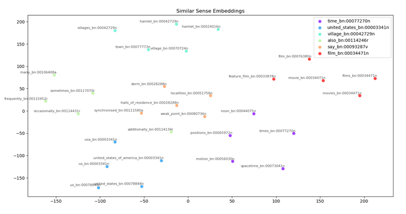
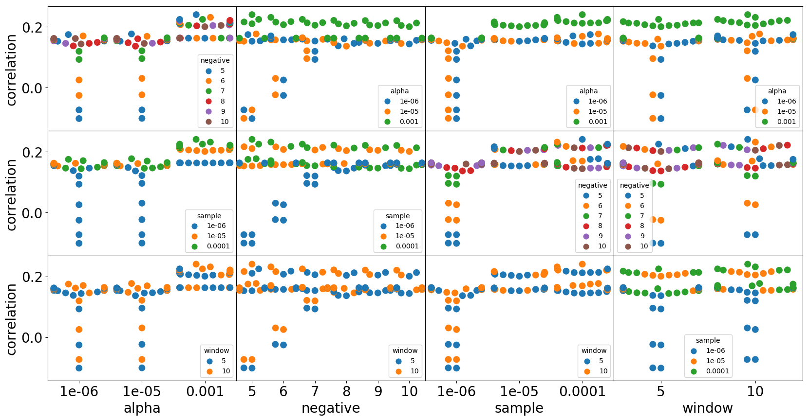

# Word Sense Embeddings

## Problem formulation

- Given context of words surrounding a target word, model has to predict correct word sense in form of `<lemma>_<synset>`.
- Output is sense embeddings not word embeddings

---

- for a detailed overview please refer to the [report](https://github.com/elsheikh21/sense_embeddings/blob/master/report.pdf)
- My Sense Embeddings for randomly selected 7 keys
- 

---

## Approach

- To run the code

  > python code/main.py --window 10 --epochs 50 --sample 1e-6 --grid_search True

### Parsing dataset

- All the needed files/resources are constructed to be fetched from directory_vars.directory_variables()
- Parsing of datasets (verbose using tqdm)

  1. [Eurosense](http://lcl.uniroma1.it/eurosense/data/eurosense.v1.0.high-precision.tar.gz)
  2. [Train-O-matic](http://trainomatic.org/data/train-o-matic-data.zip)
  3. [Semantically Enriched Wikipedia[SEW]](http://lcl.uniroma1.it/sew/data/sew_conservative.tar.gz)

  - Parsing of SEW might cause resources exhaustion error, so it was parsed in multiple files each of 5 million sentences
  - Text preprocessing: Datasets after parsing are stored in a file in the form of list of lists without numbers, stopwords, punctuation, and all characters are lowered.

### Model

- Building the model `gensim.models.Word2Vec` using defaults as a first trail and `model.build_vocab()` in order to pass the vocabulary to the model
- Followed by training the model on all the cores of my PC except 1, so I can use the PC freely
- Training the model for 30 or 50 epochs and logging the loss after each epoch, order to get an overview how the model is training
- After training we need to evaluate the model against a [gold set](http://www.cs.technion.ac.il/~gabr/resources/data/wordsim353/wordsim353.zip), and this is done using
  - Cosine similarity `model.similarity()`
  - Weighted Cosine Similarity
  - Tanimoto Similarity
- Best score achieved was 0.5954, using the following parameters
  | Parameters | Values |
  |----------|------:|
  | Alpha | 0.001 |
  | Skip-Gram | 0 |
  | Sample | 0.0001 |
  | HEIRARCHICAL SOFTMAX | 1 | \$1 |
  | Window | 10 |
  | Negative | 5 |

### Grid Search

- In order to fine tune the model, either we do it manually or use `gridsearhcv` but this results in error, so I had to build it my own, refer to [code/grid_search_model.py](https://github.com/elsheikh21/sense_embeddings/blob/master/code/grid_search_model.py)
- The results of the grid-search was plotted as well, to be able to visualize it and understand how different parameters are correlated with the score of the model (in terms of correlation between model's output and gold test)
- My Output
  

### Plotting

- Data must be visualized in order to interpret the underlying relations between sense embeddings, that was done using `t-SNE` and `PCA`

### Improvements

- Use [ElMo](https://towardsdatascience.com/transfer-learning-using-elmo-embedding-c4a7e415103c), this link is there in order to be able to formulate and prepare dataset for using with ElMo

---

## Roadmap I followed

1. [x] Parse corpus to extract info needed for training

   1. [x] Download the high_precision (is smaller but should be more reliable and kind of double checked) dataset.
      > `wget 'http://lcl.uniroma1.it/eurosense/data/eurosense.v1.0.high-precision.tar.gz'`
   2. [x] For every sentence tag
      1. [x] choose only the text with attribute `lang=en`
      2. [x] Tokenize every sentence using `nltk.tokenize.word_tokenize(S)` which returns a list
      3. [x] Change every anchor in tokenized list (step #2) to `lemma_synset`
   3. [x] Save corpus output in text file
   4. [x] Parse Train-O-Matic dataset
      1. [x] parse each file
      2. [x] get context and lemma
      3. [x] replace context with `lemma_synset` pair
   5. [x] Parse SEW dataset
      - only first 50 million sentences

   - In all datasets, all the characters were lowered, and punctuation characters were removed.

2. [x] Restrict sense embeddings only to senses in wordnet

   1. [x] file `bn2wn_mapping.txt` which contains the mapping from BabelNet synset ids to WordNet offset ids

3. [x] Train WORD2VEC model to create Sense embeddings

   1. [x] Save the output in form of `embeddings.vec`

4. [x] Test sense embeddings in word similarity text
   1. [x] Download "wordsim353" `wget 'http://www.cs.technion.ac.il/~gabr/resources/data/wordsim353/wordsim353.zip'` and use combined.tab version
   2. [x] cosine similarity
      - [x] still needs to be finalized, no clear plan to implement it yet.
5. [x] Visualize Results using T-SNE 2D & 3D

   1. [x] Sketchy implementation of the plot method
   2. [x] Test implementation

6. [x] Pipeline

- Best results acquired:
  - weighted cosine similarity = 0.5954 on 45 million sentences, approximately
